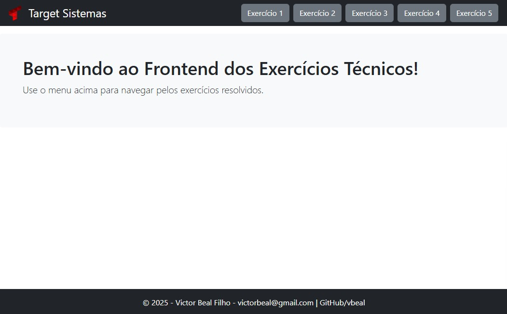
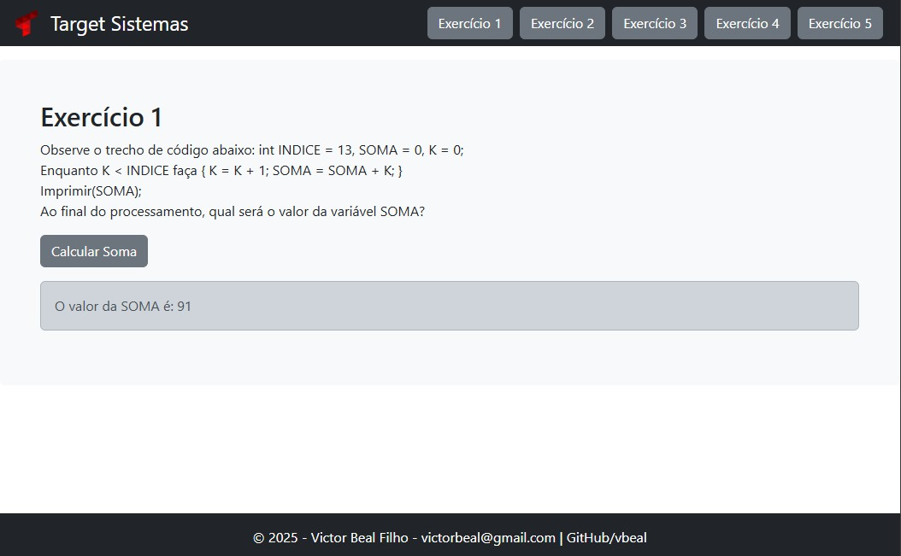
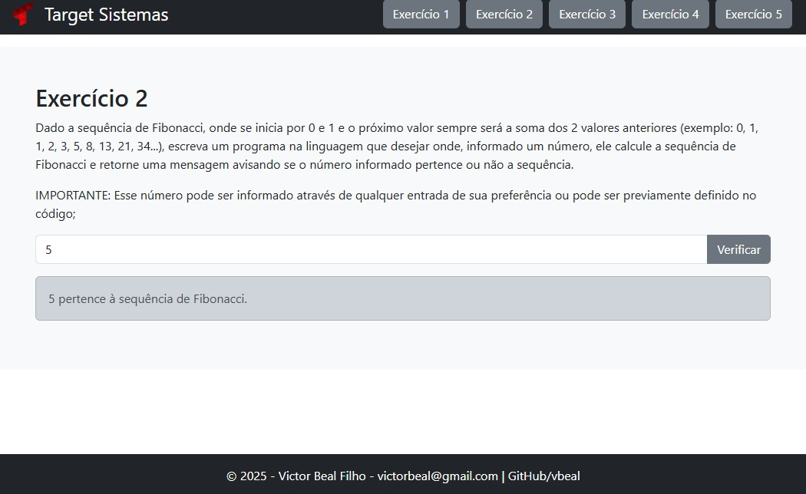
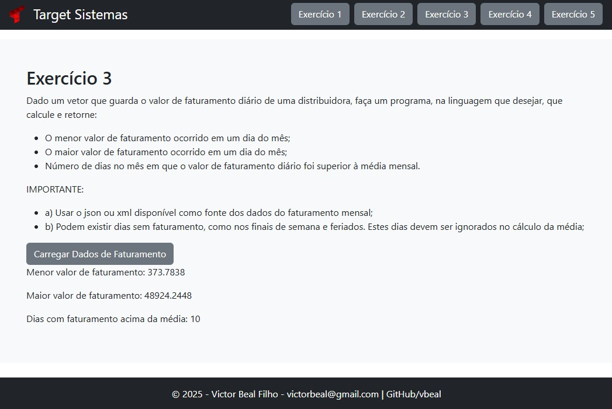
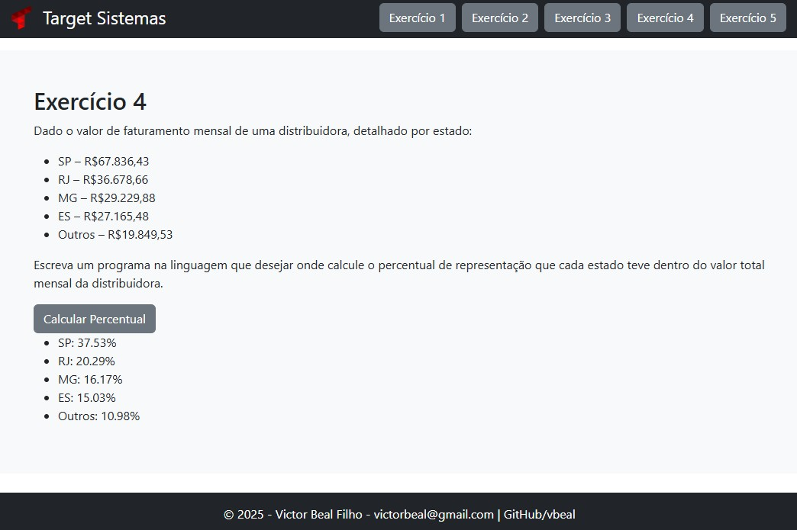
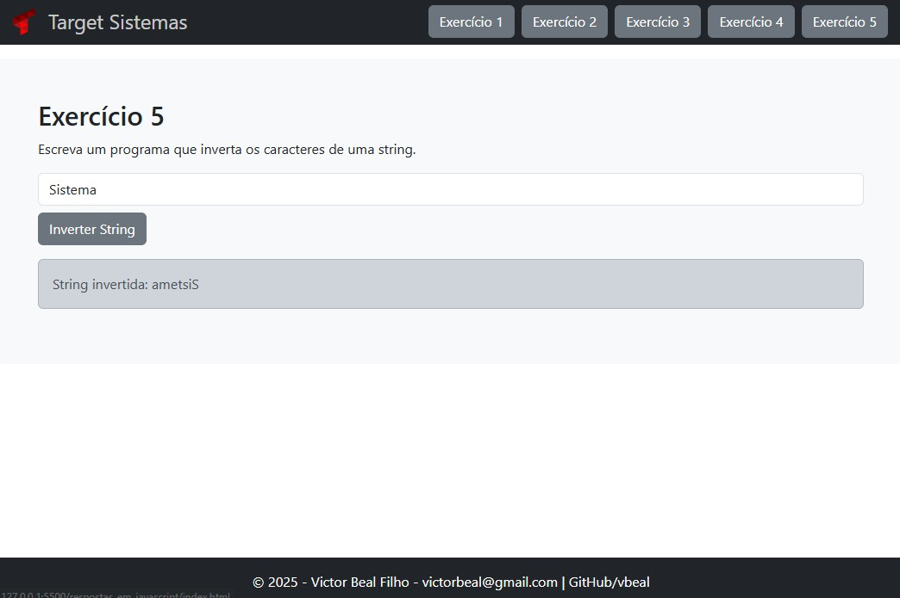

# Projeto de Exercícios de Programação para a empresa Target Sistemas

Este projeto contém soluções para uma série de exercícios de programação, abordando diferentes temas e técnicas em Python inicialmente e depois fiz em Javascript o Frontend com Bootstrap para facilitar a parte do design e ser rapido na resolução.

Abaixo está uma descrição resumida de cada exercício resolvido, juntamente com o nome do arquivo correspondente.

# Prints da resolução dos exercícios em JavaScript com Bootstrap:

- navegar até a pasta respostas_em_javascript
  
  
  
  
  
  

# Resolução do exercícios em Python

- Navegar até a pasta respostas_em_python

## Exercícios

### 1. Cálculo de Soma com Loop (tecnica1.py)

Calcula o valor final da variável `SOMA` utilizando um loop.

### 2. Verificação de Número na Sequência de Fibonacci (tecnica2.py)

Verifica se um número informado pertence à sequência de Fibonacci.

### 3. Análise de Faturamento Diário (tecnica3.py)

Calcula o menor e maior valor de faturamento diário, bem como o número de dias com faturamento acima da média mensal, utilizando dados de um arquivo JSON.

### 4. Percentual de Faturamento por Estado (tecnica4.py)

Calcula o percentual de representação do faturamento de cada estado em relação ao faturamento total da distribuidora.

### 5. Inversão de String (tecnica5.py)

Inverte os caracteres de uma string sem usar funções prontas como `reverse`.
